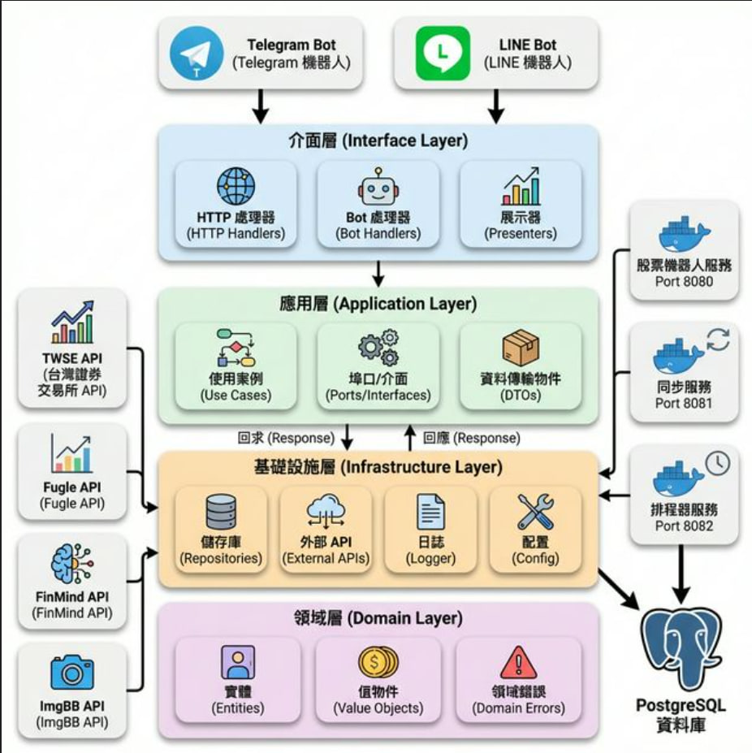
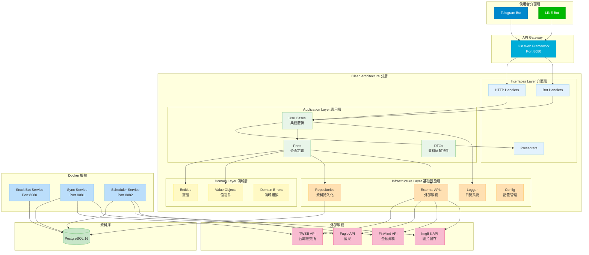

# 台股查詢機器人 🤖

一個基於 Telegram 及 Line 平台的台股資訊查詢機器人，提供即時股價、K線圖表、新聞、訂閱股票資訊等功能。
## 📑 目錄

- [Demo](#-demo-架設於免費平台功能可能不完整)
- [快速開始](#-快速開始)
- [功能特色](#-功能特色)
- [系統架構](#️-系統架構)
- [Docker 服務架構](#-docker-服務架構)
- [使用指南](#-使用指南)
- [環境變數設定](#️-環境變數設定)
- [本機開發](#-本機開發)
- [測試](#-測試)
- [部署](#-部署)
- [專案結構](#-專案結構)
- [已知問題](#-已知問題)
- [開發計劃](#-開發計劃)


## 💻 Demo (架設於免費平台,功能可能不完整)

```cmd
https://t.me/Tian_Stock_bot
```

## 🚀 快速開始

### 使用步驟
1. Clone 專案
2. 設定 `.env.example` 中的參數,並將檔名改為 `.env`
3. 在專案根目錄執行指令 `docker compose up` (本機需先安裝 🐳 Docker)
4. 開始使用 !

## 💡 功能特色

### 🔑 核心功能
- 即時股價查詢
- 技術分析圖表
- 個股新聞追蹤
- 績效資訊查看
- 多時間週期K線圖
- 定時推播股票資訊

### 🛠️ 採用技術
- ⚡ **Golang 1.24.1** + **PostgreSQL 16**
- 🏗️ **Clean Architecture** 架構設計
- 🤖 整合 **Telegram** 及 **Line Bot** 多平台支援
- 🌐 **Gin** Web 框架
- 🗄️ **GORM** ORM 框架
- 📊 **Golang Freetype** 圖表繪製
- 🐳 **Docker** 容器化部署
- 🔄 **GitHub Actions** CI/CD 自動部署
- ☁️ **AWS EC2** 雲端平台

### 🛡️ 額外技術
- 健康檢查機制 (Health Checks)
- 結構化日誌系統 (Zap Logger)
- 配置管理 (Viper)
- 依賴注入 (Dependency Injection)

## 🏗️ 系統架構

本專案採用 **Clean Architecture** 設計模式,分為四個主要層次:

### 整體架構圖



<details>
<summary>📊 點擊查看 Mermaid 架構圖程式碼</summary>



</details>

### 專案目錄結構

```
stock-bot/
├── cmd/                          # 應用程式入口
│   ├── bot/                      # 主要 Bot 服務
│   ├── sync_stock_info/          # 股票資料同步服務
│   └── notification_stock_info/  # 定時通知服務
├── internal/
│   ├── domain/                   # 領域層 (實體、值物件、領域錯誤)
│   ├── application/              # 應用層 (Use Cases、Ports)
│   ├── infrastructure/           # 基礎設施層 (Repository、外部 API)
│   └── interfaces/               # 介面層 (HTTP Handlers、Bot Handlers)
├── pkg/                          # 共用套件
└── docker-compose.yml            # Docker 編排設定
```

### 架構說明

#### 1. Domain Layer (領域層)
- **Entity**: 核心業務實體 (User, Stock, Subscription 等)
- **Value Object**: 值物件 (UserType, SubscriptionType)
- **Domain Error**: 領域錯誤定義

#### 2. Application Layer (應用層)
- **Use Cases**: 業務邏輯實作
- **Ports**: 介面定義 (Repository、外部服務)
- **DTO**: 資料傳輸物件

#### 3. Infrastructure Layer (基礎設施層)
- **Repository**: 資料持久化實作
- **External API**: 外部服務整合 (TWSE、Fugle、FinMind 等)
- **Logger**: 日誌系統
- **Config**: 配置管理

#### 4. Interfaces Layer (介面層)
- **HTTP Handlers**: REST API 端點
- **Bot Handlers**: Telegram/LINE Bot 處理器
- **Presenter**: 資料格式化與呈現

### 📚 詳細架構文件
👉 **[系統架構詳細說明](docs/SYSTEM_ARCHITECTURE.md)**

包含:
- 🔄 **控制流向圖** - 展示指令如何被處理和執行
- 📊 **資料流向圖** - 展示資料在系統中的流動和儲存
- 🐳 **Docker 服務架構** - 展示容器化服務的組織
- 🚀 **CI/CD 部署流程** - 展示自動化部署流程


## 🐳 Docker 服務架構

專案包含四個主要服務:

1. **postgres** - PostgreSQL 資料庫
2. **stock-bot** - 主要 Bot 應用程式 (Port: 8080)
3. **sync-stock-info** - 股票資料同步服務 (Port: 8081)
4. **scheduler** - 定時通知排程服務 (Port: 8082)

## 📖 使用指南

### 📊 K線圖表指令

**基本K線圖**  
格式: `/k [股票代碼] [時間範圍]`

時間範圍選項 (預設: d):
- `h` - 時K線
- `d` - 日K線 
- `w` - 週K線
- `m` - 月K線
- `5m` - 5分K線
- `15m` - 15分K線
- `30m` - 30分K線
- `60m` - 60分K線

### 📈 股票資訊指令

**詳細股票資訊**  
`/d [股票代碼]` - 查詢股票詳細資訊

**股票績效**  
`/p [股票代碼]` - 查詢股票績效

**股票新聞**  
`/n [股票代碼]` - 查詢股票新聞  
`/yn [股票代碼]` - 查詢Yahoo股票新聞 (預設: 台股新聞)

**當日收盤資訊**  
`/i [股票代碼]` - 查詢當日收盤資訊

### 🏢 市場總覽指令

**大盤資訊**  
`/m` - 查詢大盤資訊

**交易量排行**  
`/t` - 查詢當日交易量前20名

### 🔔 訂閱股票資訊

**訂閱管理**  
- `/add [股票代碼]` - 訂閱股票
- `/del [股票代碼]` - 取消訂閱股票
- `/list` - 查詢已訂閱功能及股票

**訂閱服務**  
- `/sub 1` - 訂閱當日個股資訊
- `/sub 2` - 訂閱觀察清單新聞
- `/sub 3` - 訂閱當日市場成交行情
- `/sub 4` - 訂閱當日交易量前20名
- (取消訂閱: unsub + 代號)

## ⚙️ 環境變數設定

### 資料庫設定
```env
DB_HOST=postgres
DB_PORT=5432
DB_USER=postgres
DB_PASSWORD=password
DB_NAME=stock-bot-go
DB_LOG=false
DOCKER_DB_PORT=5432
```

### LINE Bot 設定
```env
CHANNEL_ACCESS_TOKEN=your_line_channel_access_token
CHANNEL_SECRET=your_line_channel_secret
LINE_BOT_WEBHOOK_PATH=/linebot/webhook
```

### Telegram Bot 設定
```env
TELEGRAM_ADMIN_CHAT_ID=your_admin_chat_id
TELEGRAM_BOT_TOKEN=your_telegram_bot_token
TELEGRAM_BOT_WEBHOOK_DOMAIN=your_webhook_domain
TELEGRAM_BOT_WEBHOOK_PATH=/telegram/webhook
TELEGRAM_BOT_SECRET_TOKEN=your_secret_token
```

### API Keys
```env
FINMIND_TOKEN=your_finmind_token
FUGLE_API_KEY=your_fugle_api_key
IMGBB_API_KEY=your_imgbb_api_key
```

## 🔧 本機開發

### 前置需求
- Go 1.24.1 或更高版本
- Docker 和 Docker Compose
- PostgreSQL 16 (若不使用 Docker)

### 安裝步驟

1. **Clone 專案**
```bash
git clone https://github.com/tian841224/stock-bot.git
cd stock-bot
```

2. **安裝依賴**
```bash
go mod download
```

3. **設定環境變數**
```bash
cp .env.example .env
# 編輯 .env 填入必要的設定
```

4. **啟動服務**
```bash
# 使用 Docker Compose
docker compose up -d

# 或手動編譯執行
go build -o bot ./cmd/bot
go build -o sync_stock_info ./cmd/sync_stock_info
go build -o notification_stock_info ./cmd/notification_stock_info

./bot
```

5. **驗證服務**
```bash
# 檢查健康狀態
curl http://localhost:8080/health
```

## 🧪 測試

```bash
# 執行所有測試
go test -v ./...

# 執行特定套件測試
go test -v ./internal/application/usecase/...

# 執行測試並顯示覆蓋率
go test -v -cover ./...

# 產生覆蓋率報告
go test -coverprofile=coverage.out ./...
go tool cover -html=coverage.out
```

## 🚀 部署

### 使用 Docker Compose

```bash
# 啟動所有服務
docker compose up -d

# 查看服務狀態
docker compose ps

# 查看日誌
docker compose logs -f

# 停止服務
docker compose down
```

### CI/CD 自動部署

專案使用 GitHub Actions 自動部署到 AWS EC2:

1. **Build** - 編譯 Go 程式並執行測試
2. **Push** - 建置 Docker 映像檔並推送到 Docker Hub
3. **Deploy** - 自動部署到 EC2 伺服器

部署流程會在推送到 `master` 或 `main` 分支時自動觸發。

## 📁 專案結構

```
stock-bot/
├── cmd/                              # 應用程式入口
│   ├── bot/                          # 主要 Bot 服務
│   ├── sync_stock_info/              # 股票資料同步服務
│   └── notification_stock_info/      # 定時通知服務
├── internal/
│   ├── domain/                       # 領域層
│   │   ├── entity/                   # 實體
│   │   ├── valueobject/              # 值物件
│   │   └── error/                    # 領域錯誤
│   ├── application/                  # 應用層
│   │   ├── port/                     # 介面定義
│   │   ├── usecase/                  # 業務邏輯
│   │   └── dto/                      # 資料傳輸物件
│   ├── infrastructure/               # 基礎設施層
│   │   ├── persistence/              # 資料持久化
│   │   ├── external/                 # 外部服務
│   │   ├── logger/                   # 日誌系統
│   │   └── config/                   # 配置管理
│   └── interfaces/                   # 介面層
│       ├── http/                     # HTTP 處理器
│       └── bot/                      # Bot 處理器
├── pkg/                              # 共用套件
├── docs/                             # 文件
├── .github/workflows/                # GitHub Actions
├── docker-compose.yml                # Docker 編排
├── Dockerfile                        # Bot 服務映像檔
├── Dockerfile.sync                   # 同步服務映像檔
├── Dockerfile.scheduler              # 排程服務映像檔
└── go.mod                            # Go 模組定義
```

## 🚨 已知問題

- 部分外部 API 可能有請求限制
- 免費平台部署可能有效能限制

## 📝 開發計劃

- [ ] 股價到價通知
- [ ] 新增美股市場
- [ ] 增加更多技術指標
- [ ] 優化圖表繪製效能
- [ ] 增加單元測試覆蓋率

## 🤝 貢獻指南

歡迎提交 Issue 和 Pull Request 來協助改善專案!

### 貢獻流程

1. Fork 本專案
2. 建立您的特性分支 (`git checkout -b feature/AmazingFeature`)
3. 提交您的修改 (`git commit -m 'Add some AmazingFeature'`)
4. 推送到分支 (`git push origin feature/AmazingFeature`)
5. 開啟 Pull Request

### 程式碼規範

- 遵循 Go 官方程式碼風格
- 使用 `gofmt` 格式化程式碼
- 執行 `go vet` 檢查程式碼
- 為新功能撰寫測試
- 保持 Clean Architecture 原則

## 📄 授權

本專案採用 MIT 授權 - 詳見 [LICENSE](LICENSE) 檔案

## 🙏 資料與技術提供

- [TWSE](https://www.twse.com.tw/) - 台灣證券交易所
- [FinMind](https://finmindtrade.com/) - 金融資料 API
- [Fugle](https://www.fugle.tw/) - 富果股票 API
- [Telegram Bot API](https://core.telegram.org/bots/api)
- [LINE Messaging API](https://developers.line.biz/en/services/messaging-api/)

## 📊 專案狀態


---

⭐ 如果這個專案對您有幫助,請給個星星支持一下!
