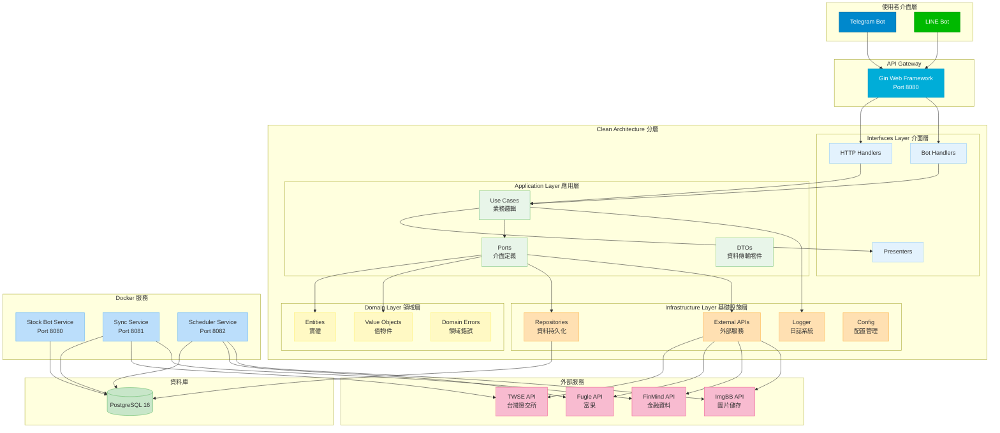
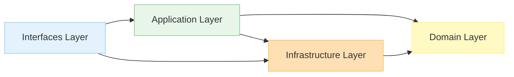
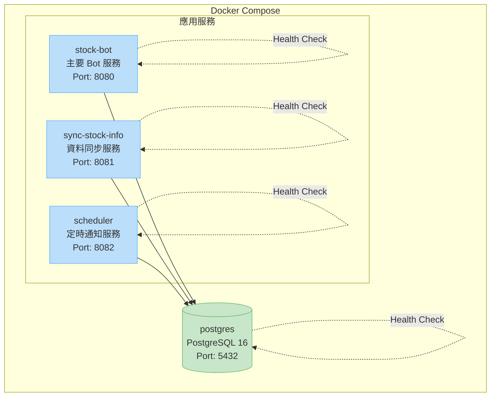
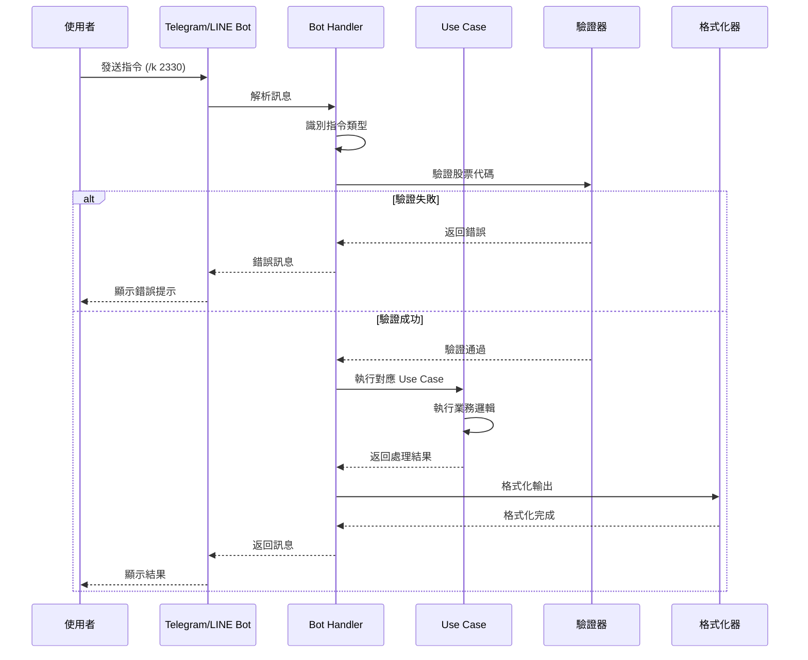
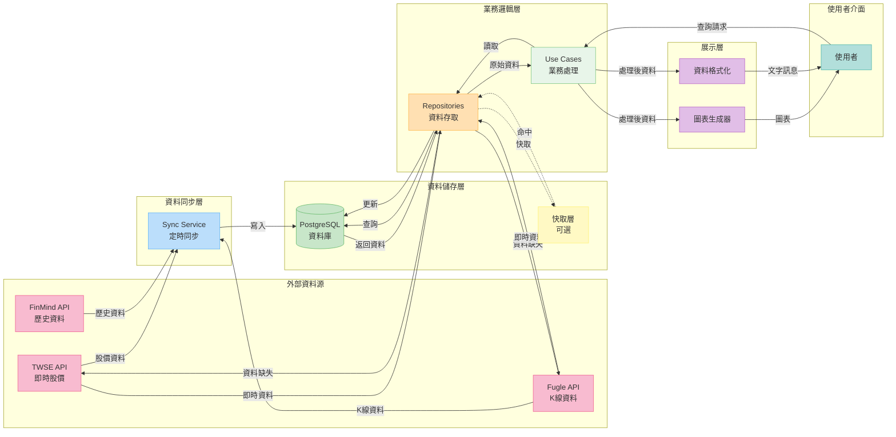

# Stock Bot 系統架構圖

## 整體系統架構

## Clean Architecture 依賴方向

## Docker 服務架構

## CI/CD 部署流程

```mermaid
graph LR
    A[GitHub Push] --> B[GitHub Actions]
    
    subgraph "Build Job"
        B --> C[Go Build]
        C --> D[Go Test]
        D --> E[Go Vet]
    end

    subgraph "Push Job"
        E --> F[Build Docker Images]
        F --> G[Push to Docker Hub]
    end

    subgraph "Deploy Job"
        G --> H[SSH to EC2]
        H --> I[Pull Images]
        I --> J[Docker Compose Up]
    end

    J --> K[AWS EC2]

    style A fill:#f8bbd0,stroke:#f06292
    style B fill:#e1bee7,stroke:#ba68c8
    style C fill:#c5cae9,stroke:#7986cb
    style D fill:#c5cae9,stroke:#7986cb
    style E fill:#c5cae9,stroke:#7986cb
    style F fill:#b2dfdb,stroke:#4db6ac
    style G fill:#b2dfdb,stroke:#4db6ac
    style H fill:#fff9c4,stroke:#fff176
    style I fill:#fff9c4,stroke:#fff176
    style J fill:#fff9c4,stroke:#fff176
    style K fill:#ffccbc,stroke:#ff8a65
```

## 控制流向 (Control Flow)

展示使用者指令如何在系統中被處理和執行:

## 資料流向 (Data Flow)

展示資料在系統各層之間的流動和儲存:

## 資料流向詳細說明

### 1. 資料同步流程
- **Sync Service** 定時從外部 API 獲取最新資料
- 資料經過驗證和轉換後儲存到 PostgreSQL
- 確保資料庫中的資料保持最新

### 2. 資料查詢流程
- 使用者發送查詢請求
- Use Case 透過 Repository 從資料庫讀取資料
- 如果資料不存在或過期,直接呼叫外部 API 獲取
- 新資料會被儲存到資料庫供後續使用

### 3. 資料展示流程
- 原始資料經過業務邏輯處理
- 根據需求生成圖表或格式化為文字
- 最終呈現給使用者
